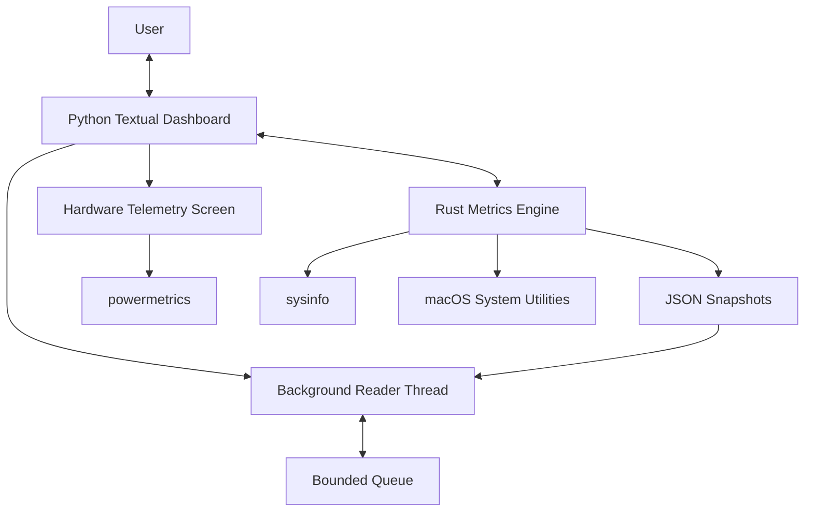

# SysDash

A terminal-based system monitoring dashboard built with Python, Textual, and Rust for macOS.

SysDash combines a live system overview with a dedicated Apple Silicon hardware telemetry screen, bringing resource monitoring and low-level hardware measurements into a single terminal interface.

## Architecture

SysDash uses a hybrid Python–Rust architecture that separates the terminal user interface from system-level metric collection.

### System Overview



### Components

- **Python UI (`main.py`)** — Renders the interactive terminal dashboard using Textual and Rich, processes user input, and displays system metrics.
- **Rust Metrics Engine (`engine/rust-engine/`)** — Collects system statistics using Rust and `sysinfo`, including CPU utilization, memory, swap, disk I/O, network throughput, process information, and system uptime.
- **Process Communication** — The Python application launches the Rust engine as a subprocess. The engine streams JSON snapshots through standard output, which a background reader thread consumes and places in a bounded queue. The UI periodically retrieves the latest snapshot to refresh the dashboard.
- **Hardware Telemetry (`hardware_telemetry.py`)** — Provides a dedicated screen for hardware power and thermal telemetry. It uses macOS-specific utilities, including `powermetrics`, for metrics supported by the host system.
- **macOS Integration** — Additional system information, such as battery status, thermal status, and memory pressure, is collected through macOS utilities where supported.

### Data Flow

1. The Python application starts the Rust metrics engine.
2. The Rust engine collects system statistics and serializes them as JSON.
3. A background thread reads the JSON stream and places snapshots in a bounded queue.
4. The Textual UI consumes the latest available snapshot and updates the dashboard.
5. The hardware telemetry screen uses its dedicated collection mechanism for supported power and thermal metrics.

### Design Rationale

The separation between the UI and metrics engine keeps presentation logic independent of system monitoring. Rust handles metric collection, while Python and Textual provide a flexible interface for rendering and interacting with the data. JSON-based subprocess communication keeps the components loosely coupled.


## Features

### System Dashboard
- Live CPU utilization and per-core usage
- Memory and swap utilization
- Network throughput and interface statistics
- Disk storage and read/write activity
- Top CPU-consuming and memory-consuming processes
- Process filtering and sortable tables
- Historical resource graphs
- Uptime, process count, and load averages

### Hardware Telemetry
- CPU power consumption
- GPU power consumption
- Apple Neural Engine (ANE) power, when reported
- Combined power readings, when reported
- Active frequency, when reported
- macOS thermal pressure
- Scrolling power-history graphs

Hardware telemetry uses Apple's `powermetrics` utility and may require administrator authentication. Available measurements depend on the Mac model and macOS version.

## Tech Stack

- **Python** — application logic and UI integration
- **Textual** — terminal user interface
- **Rich** — terminal formatting
- **Rust** — system metrics collection
- **sysinfo** — system information collection in the Rust engine
- **macOS powermetrics** — hardware power and performance telemetry

## Requirements

- macOS
- Python 3
- Rust and Cargo
- Xcode Command Line Tools
- Homebrew (recommended)

Some hardware telemetry features require administrator privileges.

## Installation

### 1. Clone the repository

```bash
git clone https://github.com/YOUR_USERNAME/sysdash.git
cd sysdash
```

Replace `YOUR_USERNAME` with your GitHub username.

### 2. Create a Python virtual environment

```bash
python3 -m venv .venv
source .venv/bin/activate
```

### 3. Install Python dependencies

```bash
python -m pip install textual psutil rich
```

### 4. Build the Rust engine

```bash
cd engine/rust-engine
cargo build
cd ../..
```

If your macOS installation requires a specific SDK configuration, follow the build instructions for your local environment.

### 5. Launch SysDash

```bash
python main.py
```

Use `Ctrl+C` to exit the dashboard.

## Project Structure

```text
sysdash/
├── main.py
├── hardware_telemetry.py
├── engine/
│   └── rust-engine/
│       ├── Cargo.toml
│       ├── Cargo.lock
│       └── src/
│           └── main.rs
├── .gitignore
└── README.md
```

## Design

SysDash uses a dark terminal interface with live metrics, compact panels, and historical graphs. Python handles the interface, while the Rust engine collects system statistics.

Hardware telemetry is handled separately through macOS utilities.

## Limitations

- Hardware metrics vary by device and macOS version.
- Some telemetry requires elevated privileges.
- Hardware power readings do not necessarily represent total battery or wall power consumption.
- Metrics unavailable from the operating system are not guaranteed to appear.

## License

This project is currently unlicensed. Add a license before allowing others to reuse or redistribute the code.
